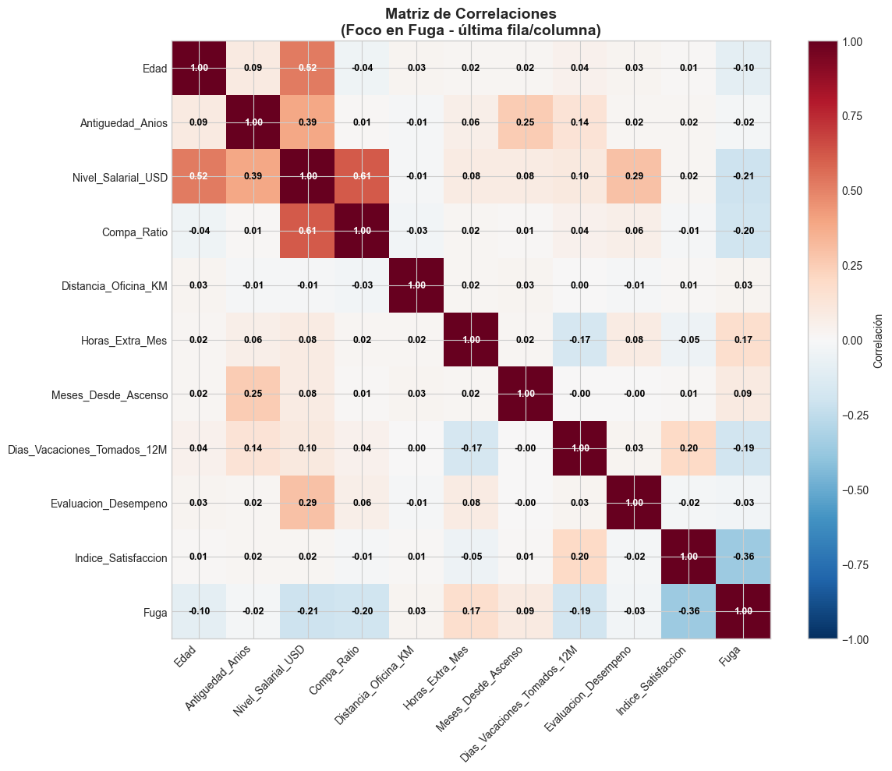
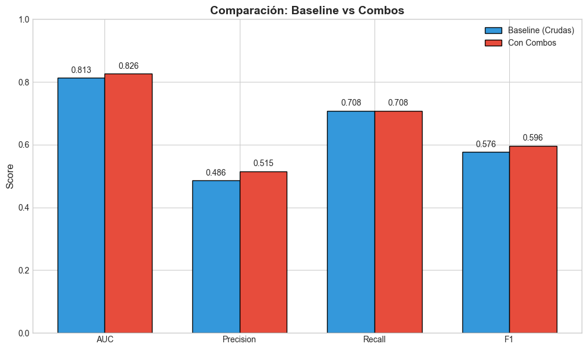
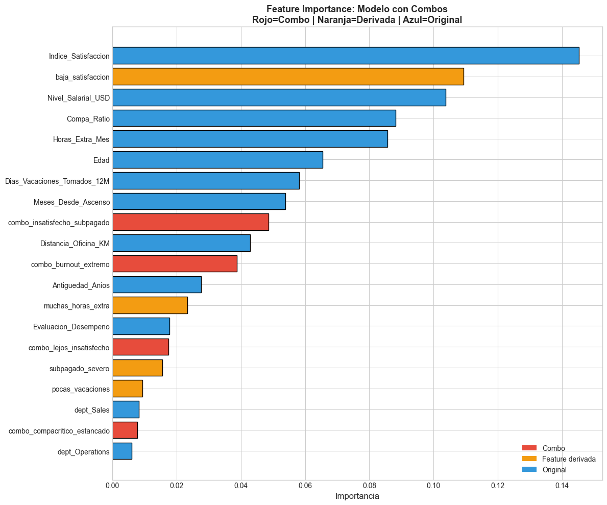
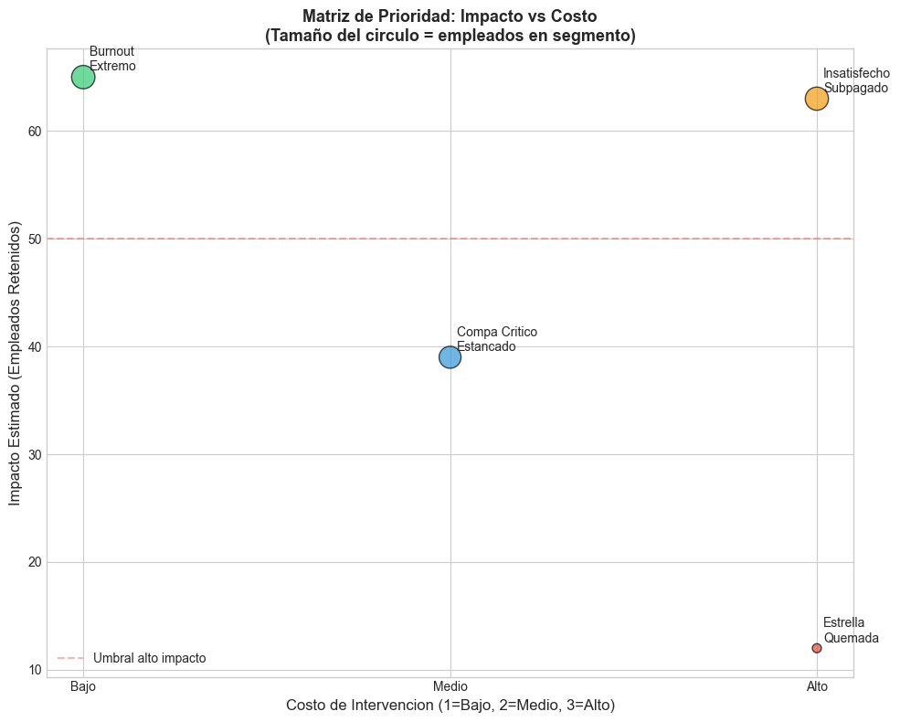

# 🎯 Predicción de Fuga de Talento

Proyecto de People Analytics con Machine Learning para predecir fuga de empleados.

## 📊 Resultados

- **Dataset:** 1,000 empleados (sintético, ajustado a tendencias 2024-2025)
- **Modelo:** Random Forest con Feature Engineering de combos críticos
- **Performance:** AUC 0.826 | Recall 70.8% | F1 0.596

## 🔍 Hallazgos principales

| Segmento | Tamaño | Fuga | Prioridad | Acción clave |
|----------|--------|------|-----------|--------------|
| 🔴 Burnout Extremo | 113 | 57.5% | #1 | Vacaciones forzadas |
| 🔴 Estrella Quemada | 17 | 70.6% | #2 | Revisión salarial |
| 🔴 Insatisfecho + Subpagado | 111 | 56.8% | #3 | Ajuste compa-ratio |
| 🟠 Compa Crítico + Estancado | 100 | 39.0% | #4 | Plan de desarrollo |

## 🚀 Cómo usar

```bash
pip install -r requirements.txt
jupyter notebook analysis.ipynb
```
## 🛠️ Stack
Python · Pandas · NumPy · Scikit-learn · Matplotlib

## 💡 Lecciones clave
1-Los combos de interacción superan a variables aisladas — Burnout (HE + vacaciones + satisfacción) es más predictivo que cualquiera sola.

2-Correlación ≠ Importancia del modelo — Satisfacción tenía la mayor correlación, pero el RF distribuyó poder entre variables colineales.

3-Priorización por ROI — No todos los segmentos se tratan igual; el volumen y costo de intervención importan.

## 📸 Gráficos del análisis

### Comparación de modelos

### Matriz de correlaciones


### Comparación de modelos



### Feature Importance


### Priorización por ROI

